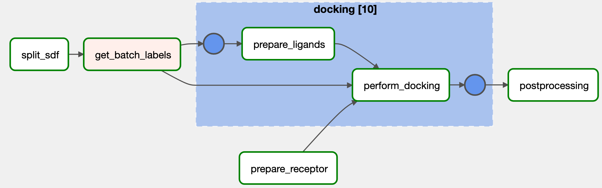

# AutoDock-GPU workflow on Apache Airflow
A workflow for molecular docking using AutoDock-GPU. The workflow is implemented as a DAG, and can be run in Apache Airflow, on a Kubernetes cluster.

## Description

We provide a DAG to execute molecular docking of a set of ligands to a fixed receptor, using AutoDock-GPU, with GPU acceleration on NVIDIA GPU.

*The AutoDock-GPU DAG, as presented in the Apache Airflow UI*

## Quickstart

### Folders
The main DAG is contained in `autodock.py`, we also provide with the following folders:
- `docker/` contains the `Dockerfile`, along with bash scripts which are included in the image;
- `misc/` contains various configuration files, used for testing and development;
- `plot/` contains python scripts to create plots.

### Installation checklist (see _Setup & Installation_)
- [ ] Kubernetes: PersistentVolume with name `pv-autodock`
- [ ] Kubernetes: PersistentVolumeClaim with name `pvc-autodock`
- [ ] Docker: Docker image available in public registry with name `example/autodock:1.5.3`
- [ ] Apache Airflow: pool with name `gpu_pool` is created
- [ ] Apache Airflow: autodock.py is in Apache Airflow's DAG folder. 
- [ ] DAG: in autodock.py, `PVC_NAME` is set
- [ ] DAG: in autodock.py, `IMAGE_NAME` is set
- [ ] DAG: a `.sdf` ligand database is stored in the root of the PersitentVolume.

## Setup & Installation
### Requirements
- A Kubernetes cluster
- A working Apache Airflow setup: in particular, Apache Airflow must be configured to be able to run tasks on the Kubernetes cluster.

### 1. Kubernetes _PersistentVolume_ and _PersistentVolumeClaim_
The workflow relies on a specific PersitentVolumeClaim to be present on the Kubernetes cluster to store files during execution. In this step, we describe how to create a PersistentVolume, and a PersistentVolumeClaim attached to this volume.

**PersistentVolume**. Your Kubernetes cluster administrator provides you with the name of the PersistentVolume you need to use. However, if you manage your own Kubernetes cluster, you need to create a PersistentVolume yourself, we provide an example in `misc/persistentVolume.yaml`, that you can deploy using:

```
kubectl create -f misc/persistentVolume.yaml
```

In this example, and in the rest of this tutorial, the PersistentVolume is named `pv-autodock`. Please refer to Kubernetes documentation to learn more on PersistentVolume.

**PersistentVolumeClaim**. Once you know the name of the PersistentVolume (in this example `pv-autodock`), you need to create a PersistentVolumeClaim, containing information on the storage size, and referring to the underlying PersistentVolume. An example is provided in `misc/pvclaim.yaml`, you can create it using:

```
kubectl create -f misc/pvclaim.yaml -n airflow
```

In this example, and in the rest of this tutorial, the PersistentVolumeClaim is named `pvc-autodock`. Furthermore, it has the same namespace as the one under which the Apache Airflow setup is deployed, here we use `airflow`.

### 2. Building the Docker image
A Dockerfile is provided, along with scripts that will be included in the image, in the the `docker` folder.

To build and publish the image:
```
cd docker/
docker build -t gabinsc/autodock-gpu:1.5.3
docker push gabinsc/autodock-gpu:1.5.3
```

Please refer to Docker documentation for more details on building an image, and publishing it. Make sure that the image is published to a public Docker registry, or at least to a registry which is accessible from the Apache Airflow setup.

### 3. Deploying and adapting the DAG
In order for the DAG to be executed in your specific environment, some adjusments are required.

1. Place the `autodock.py` file in the DAG folder of your Apache Airflow setup.
2. Adjust the following constants in autodock.py:
    - `IMAGE_NAME`: name of the image that will be used for the containers.
    - `PVC_NAME`: name of the PersistentVolumeClaim created in step 1, `pvc-autodock`.
3. Validate that you can see the DAG under the name `autodock` in the Apache Airflow UI. If not, DAG import errors are reported in the top of the UI.

The administrator of the Apache Airflow setup must create a pool named `gpu_pool`, which will group (and limit) execution of GPU tasks. You can create a pool in the Apache Airflow UI under `Admin > Pools`. A recommandation is to set the pool size to the desired maximum number of GPUs to be used in parallel.

## Run
Before you run the DAG, place your database of ligands, in `.sdf` format, in the root of the PersistentVolume you defined when configuring your Kubernetes cluster. For example, `sweetlead.sdf`.

Click on "Trigger DAG" in the Apache Airlfow UI to start the DAG with the default parameters. You can customize the DAG parameters to your needs by clicking "Trigger DAG w/ config":
- `pdbid`: PDBID of the protein you want to use as a receptor. Note that in the PDB database, this generally refers to a protein-ligand complex; the workflow automatically keeps the longest chain in the complex.
- `ligand_db`: the name of the ligand database, without the `.sdf` extension.
- `ligands_chunk_size`: batch size

## Results analysis (_experimental_)

We provide python scripts to create readable Gantt charts, based on the workflow execution. Note that a Gantt chart can be found for each DAG execution in Apache Airflow UI, however, this chart offers limited interactivity and can be hard to read for complex or long-running DAGs.

Requirements:
- `python` (&ge; 3.9)
- python libraries: `plotly`, `requests`

Three scripts are available, each plotting a different Gantt chart:
- _Resource_ view: each line in the chart represents a slot in a pool (note that multi-slot tasks are not supported)
- _Task_ view: each line represents a tasks
- _Multi-execution resource_ view: several DAG runs can be presented on the same Gantt chart, each run has its own color.

Before running those scripts, you need to set the constants in `plot/constants.py`:
- `BASE_URL`: base URL to access Airflow API
- `SESSION_COOKIE`: session cookie, can typically be obtained from the Network section of your browser's DevTools when logged in on the Apache Airflow UI
- `DAG_ID`: the name of the DAG, `autodock`
- `POOL_ALIAS`: alias names for the various pools, will be shown in the legend

To execute a script for a specific DAG execution, you need to provide `DAG_RUN_ID`, which is the ID of the name of the particular DAG run instance you want to plot, this can be retrieved in Apache Airflow UI.

When running the scripts, figures will be written to the `figures/` folder.

## Relevant publications
- Daniel Medeiros, Gabin Schieffer, Jacob Wahlgren, Ivy Peng. 2023. _A GPU-accelerated Molecular Docking Workflow with Kubernetes and Apache Airflow_. WOCC'23

## FAQ