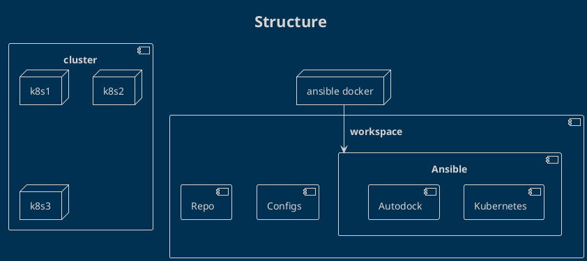

# Auto Dock Ansible

## Overview

Ansible is a built automation tool that will allow us to configure a kubernetes environment on multiple nodes as well as perform deployments against the kubernetes cluster. Ansible configurations should be versioned in github and include plain plain defaults to get someone up and running with the autodock project.

## Tasks

**General**
- [ ] Ansible:General: Create the outline of the ansible structure.
- [ ] Ansible:Automation: Create a docker image that will allow a user to run ansible commands without having to install ansible on their system.

**Kubernetes**
- [ ] Ansible:Kubernetes: Template each of the kubernetes services in the ias/ansible/templates/kubernetes directory
- [ ] Ansible:Kubernetes: Create an idempotent playbook outline to bootstrap the kubernetes cluster.

**airflow**
- [ ] Ansible:Airflow: Create a playbook to update the ligands.
- [ ] Ansible:Airflow: Create a playbook to bootstrap airflow.

## Ansible
